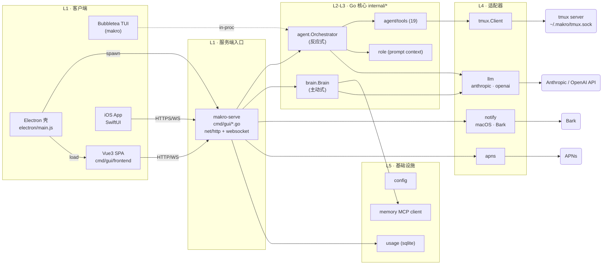
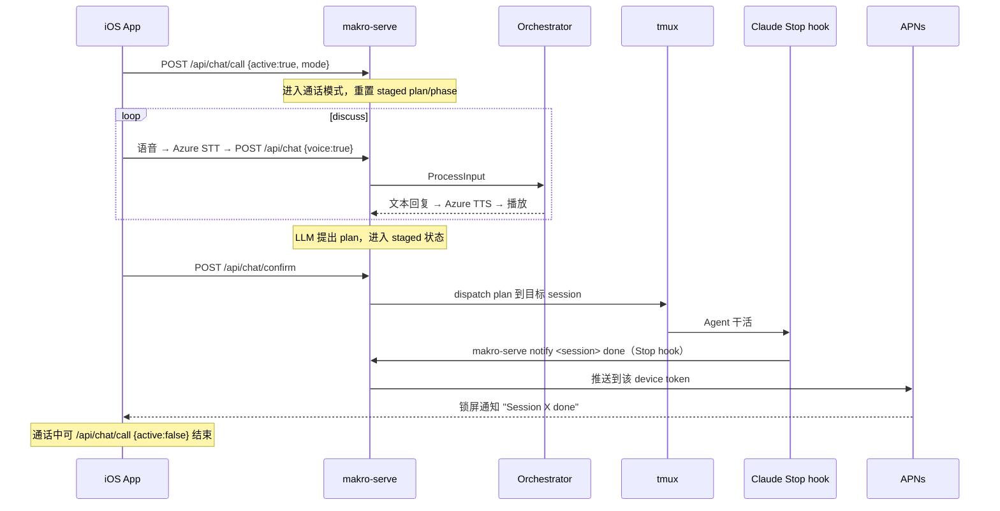
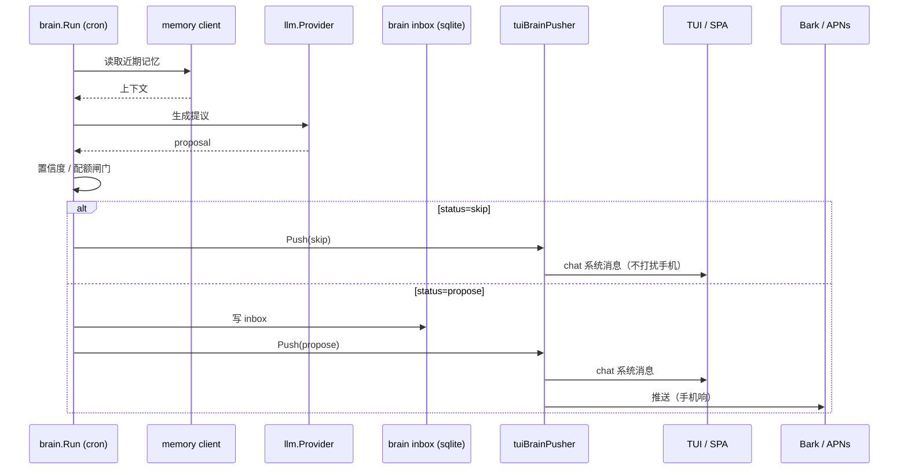

# Makro 架构说明 (ARCHITECTURE)

> 配套分层图：[`architecture.svg`](./architecture.svg) · 看板架构：[`kanban-architecture.svg`](./kanban-architecture.svg)
> 最后核对：2026-07-06（基于实际代码，非 CLAUDE.md 旧描述）

这份文档回答一个问题：**"我能否在心里建立一张可靠的地图，把任何一行代码归位？"**
它覆盖四件事：① 系统全景与分层契约；② 全组件清单（桌面 / 后端 / 前端 / iOS）；
③ 组件间的运行时调用关系与工作流；④ 图示。

> 与旧版的差异见 [§9 文档与代码漂移](#9-本轮核对修正的漂移)。简言之：旧文档把桌面壳
> 写成 Wails（实际是 Electron），漏掉了 `internal/role`，且 `main.go` 行数 / 工具数失真。
> 本版据实修正。

---

## 1. 一句话定位

Makro 是一个 **AI 编码 Agent 编排器**：管理多个后台编码 Agent（Claude Code、Copilot 等）
在 tmux 会话里并行干活，外层用 **反应式编排器**（Orchestrator）+ **主动式第二大脑**（Brain）
两层智能驱动，对外提供 **TUI / 桌面 GUI / iOS** 三种形态。三种形态共用同一套 Go 核心
（`internal/*`），核心由两个不同的二进制装配出来。

```
                ┌─────────────────────────────────────┐
                │   反应式 (Reactive)    主动式 (Proactive) │
                │   Orchestrator          Brain        │
                │   "用户说什么 → 调工具"   "记忆 → 主动提议"  │
                └─────────────────────────────────────┘
```

两种智能共用同一套基础设施（tmux / LLM / memory），但 **触发源不同**：编排器由用户输入
驱动，大脑由定时唤醒驱动。这是整个系统的核心二元结构。

---

## 2. 系统全景

### 2.1 三种形态，一个核心

```
                          ┌─────────────────────────────────────────────┐
                          │              Go 核心 (internal/*)             │
                          │  L2: agent(Orchestrator) · brain              │
                          │  L3: tools · skills · role                   │
                          │  L4: llm · tmux · notify · apns              │
                          │  L5: config · usage                           │
                          └──────────────────┬──────────────────────────┘
                                             │ 装配 (composition root)
              ┌──────────────────────────────┼──────────────────────────────┐
              ▼                              ▼                              ▼
   ① 二进制 `makro`                ② 二进制 `makro-serve`           (无独立二进制)
   main.go + internal/tui          cmd/gui/*.go                      纯客户端
   Bubbletea 分屏 TUI              net/http + gorilla/websocket
   本机终端里跑                    由 Electron 拉起，监听 127.0.0.1:7070
              │                              │ TLS+self-signed+Bearer
              │                              │
              │              ┌───────────────┼───────────────┐
              │              ▼               ▼               ▼
              │   Electron 渲染进程      iOS App           任何浏览器
              │   Vue3 SPA              SwiftUI            (同 SPA)
              │   (cmd/gui/frontend)    (ios/Makro)
              ▼
        本机用户
```

**关键事实**：

- **两个 Go 二进制**，共享 L2–L6：
  - `makro`（根 `main.go`，v0.6.0）— Bubbletea TUI 形态。装配根直接在 `main()` 里 wire 好
    Orchestrator + Brain + TUI，进程内调用。
  - `makro-serve`（`cmd/gui/main.go`，由 `cmd/gui/package.json` v0.7.0 打包）— HTTP/WS server，
    被 Electron 作为子进程拉起（`makro-serve serve --addr 127.0.0.1:7070 --tls-cert … --password …`）。
- **桌面壳 = Electron，不是 Wails。** `cmd/gui/package.json` 的 `main` 是 `electron/main.js`，
  `extraResources` 把 `bin/makro-serve` + `frontend/dist` + `certs/*.pem` 一起打进 `.app`。
  Electron 主进程负责拉起 Go server、起窗口；渲染进程加载 Vue3 SPA。
- **iOS 与桌面 SPA 是对等的两个客户端**，调同一个 Go server 的同一套 `/api/*` + `/ws/*`。
  iOS 用原生 SwiftUI（`APIClient.swift`），不走 SPA。

### 2.2 全景组件图



---

## 3. 分层模型

严格 6 层，依赖**只能自上而下**。同一层包之间**禁止互相依赖**（除非通过接口）。

| 层 | 职责 | 包 / 单元 | 颜色 |
|----|------|-----------|------|
| **L1 Presentation / Entry** | 进程入口、UI、人机交互、HTTP/WS 服务端 | `main.go`、`internal/tui`、`cmd/gui`（Go server + Electron + Vue SPA）、`ios/Makro` | slate |
| **L2 Application** | 业务流程编排、智能决策 | `internal/agent`（Orchestrator）、`internal/brain` | blue |
| **L3 Domain Tools** | 可调用的能力单元、技能、角色 | `internal/agent/tools`、`internal/agent/skills`、`internal/role`、hooks/guardian（在 agent 内） | green |
| **L4 Providers / Adapters** | 外部系统适配器 | `internal/llm`、`internal/tmux`、`internal/notify`、`internal/apns` | violet |
| **L5 Infrastructure** | 配置、持久化、外部服务客户端 | `internal/config`、`internal/usage`、`brain/memory_client` | amber |
| **L6 Shared Kernel** | 无依赖的通用工具 | `internal/util` | gray |

### 分层铁律

1. **依赖单向**：L_N 只能依赖 L_{>N}。`util` 谁都能用，它不用任何人。
2. **同层不互依赖**：L2 的 `agent` 和 `brain` 不直接 import 对方的具体类型；协作要么走更下层的
   共享接口，要么由 L1 装配根做胶水（见 [§6.2](#62--已解决--brain-反向依赖-agent原-p1)）。
3. **接口归消费方**（DIP）：抽象定义在**调用方**包，实现在**提供方**包。`llm.Provider` 定义在
   `internal/llm`，被 `agent`/`brain` 消费。
4. **装配只在 L1**：`main.go` 和 `cmd/gui` 是唯二允许"知道所有包"的地方。`NewOrchestrator(...)`
   这种构造调用只出现在入口。

---

## 4. 组件清单（桌面 / 后端 / 前端 / iOS）

### 4.1 桌面端（Electron 应用）

| 组件 | 路径 | 角色 |
|------|------|------|
| Electron 主进程 | `cmd/gui/electron/main.js` | 拉起 `makro-serve` 子进程、创建 BrowserWindow、注入 TLS/密码、生命周期 |
| 打包配置 | `cmd/gui/package.json` | `electron-builder --mac` → `.dmg`；`appId: com.cybernagle.makro`，v0.7.0 |
| 自签证书 | `cmd/gui/certs/*.pem` | 127.0.0.1 TLS（iOS 信任通过 `URLSessionDelegate` 处理） |
| 构建产物 | `bin/makro-serve`（server）、`gui`（根）/`cmd/gui/gui` | Go 二进制；`gui`/`cmd/gui/gui`/`makro` 是 **gitignored 的本地构建产物**（`.gitignore:16-17,42`），非源码、不入库 |

### 4.2 后端（Go HTTP/WS server，二进制 `makro-serve`）

入口 `cmd/gui/main.go` → `serve()`（`server.go`）。**`server.go` ~1182 行，是 HTTP 层主体。**

| 文件 | 职责 |
|------|------|
| `cmd/gui/main.go` | 子命令分发：`serve` / `notify` / `permission` / `capture` / `claude-start`（hook 转发器） |
| `cmd/gui/server.go` | 路由注册 + 中间件（CORS、Bearer auth、TLS）+ 大部分 handler |
| `cmd/gui/chat_service.go` | **36.9K，最大文件。** 装配 Orchestrator/Brain，处理 chat、确认/否认、语音呼叫模式、用量查询 |
| `cmd/gui/tmux_service.go` | tmux 会话管理（list/create/kill），委托 `internal/tmux.FindTmuxBin` |
| `cmd/gui/terminal_service.go` | 终端 PTY 桥（`creack/pty`），喂给 `/ws/xterm` |
| `cmd/gui/snapshot.go` | tmux pane 快照渲染，喂给 `/ws/snapshot` |
| `cmd/gui/task_service.go` | 看板任务存储（`/api/tasks`，内存或轻持久化） |
| `cmd/gui/artifact_service.go` | 中央 artifact 商店 `~/.makro/artifacts/<session>/`（含 P0 path-traversal 校验） |
| `cmd/gui/chat_history.go` | chat 历史持久化 |
| `cmd/gui/device_store.go` | iOS APNs device-token 注册表 |
| `cmd/gui/cc_skill.go` | 把 `makro-artifacts` skill 写进 `~/.claude/skills/`（idempotent） |

**HTTP/WS 路由面**（`server.go:181-211`）：

| 类别 | 端点 |
|------|------|
| 会话 | `GET/POST /api/sessions`、`DELETE /api/sessions/{name}`、`/api/sessions/{name}/{capture\|send\|viewed}` |
| Chat | `POST /api/chat`、`/api/chat/history`、`/api/chat/cancel`、`/api/chat/confirm`、`/api/chat/deny`、`/api/chat/call` |
| 看板 | `GET/POST /api/tasks`、`PUT/DELETE /api/tasks/{id}`、`POST /api/tasks/{id}/send` |
| 用量 | `/api/usage/{stats\|diagnostics\|timeline\|export}` |
| Artifact | `GET /api/artifacts?session=`、`GET /api/artifact?session=&path=` |
| 推送 | `POST /api/device-token`（iOS 注册 APNs token） |
| 系统 | `GET /api/snapshot`、`GET /api/recover` |
| WebSocket | `/ws/xterm/{session}`（终端流）、`/ws/snapshot/{session}`（快照流）、`/ws/chat`（双向 chat） |
| 静态 | `GET /` → `frontend/dist`（SPA，`http.FileServer`） |

### 4.3 前端（Vue3 SPA）

| 组件 | 路径 | 角色 |
|------|------|------|
| 入口 | `cmd/gui/frontend/index.html`、`vite.config.js` | Vite 构建的 SPA，产物 `frontend/dist/`，由 Go server 在 `/` 提供 |
| 架构页 | `cmd/gui/frontend/architecture.html` | 内置的架构展示页 |
| 终端渲染 | xterm.js（经 `/ws/xterm`） | 右侧 pane 的 tmux 终端回显 |

> SPA 跑在 Electron 渲染进程里，调本机 `127.0.0.1:7070`。与 iOS 共用同一组 API。

### 4.4 iOS App（`ios/Makro/Makro/`，SwiftUI）

| 文件 | 职责 |
|------|------|
| `MakroApp.swift` / `AppDelegate.swift` | 入口、APNs 注册、`URLSessionDelegate` TLS 自签信任 |
| `APIClient.swift` | **唯一的服务端契约层**：sessions / tasks / chat / artifacts / device-token，Bearer auth |
| `Config.swift` | `httpBaseURL`、password、TLS 处理 |
| `ChatViewModel.swift` / `ChatView.swift` | 对话（含 `/api/chat/confirm\|deny\|call` 的语音呼叫模式） |
| `TerminalViewModel.swift` | 终端查看（snapshot/ws） |
| `SessionsViewModel.swift` / `SessionsView.swift` | 会话管理 |
| `KanbanViewModel.swift` / `KanbanView.swift` | 看板任务 |
| `ArtifactsView.swift` / `ArtifactPreviewView.swift` | artifact 列表与预览（WKWebView / AVPlayer 本地加载） |
| `AzureSpeechManager.swift` | Azure 语音双向通话（STT+TTS，F0 配额计量） |
| `VoiceActivityDetector.swift` | 本地 VAD，静音断句 |
| `NowPlayingManager.swift` | 锁屏控制（`MPNowPlayingInfoCenter`） |
| `CallView.swift` / `StartCallIntent.swift` | 通话 UI + Siri 快捷指令 |
| `KeychainHelper.swift` | password / token 安全存储 |
| `Models.swift` | 与 Go server 对齐的 Codable 模型 |

> iOS 构建：xcodegen + CocoaPods + xcodebuild（**不是 SPM**）。详见根 `CLAUDE.md` 的
> "iOS App + Azure Speech" 一节。

### 4.5 Go 核心（`internal/*`，按层）

| 层 | 包 | 关键文件 | 职责 |
|----|----|----------|------|
| L2 | `internal/agent` | `orchestrator.go`(701) `commands.go` `guardian.go` `hooks.go` `notifier.go` `hook_config.go` | 反应式编排器 + 子组件 |
| L2 | `internal/brain` | `brain.go`(323) `propose.go`(198) `capture.go` `inbox.go` `commands.go` `feedback.go` `reader.go` `memory_client.go` | 主动式第二大脑 |
| L3 | `internal/agent/tools` | `all.go` + **19 个工具** | 编排器的"手脚" |
| L3 | `internal/agent/skills` | `loader.go` `parser.go` `types.go` | Skill 加载/解析 |
| L3 | `internal/role` | `role.go` `loader.go` `store.go` `prompt.go` | 角色定义 + prompt 渲染 |
| L4 | `internal/llm` | `provider.go` `types.go` `anthropic.go` `openai.go` | LLM 抽象（`Provider.Stream/Complete`） |
| L4 | `internal/tmux` | `client.go` `session.go` `parser.go` `commands.go` `keepalive.go` `detect_*.go` | tmux CLI 封装 + 状态镜像 |
| L4 | `internal/notify` | `notify.go` `client.go` `bark.go` | macOS 通知 + Bark 推送 |
| L4 | `internal/apns` | `apns.go` | APNs（ES256 + JWT）推 iOS |
| L5 | `internal/config` | `config.go` | config.json + env + `.claude/settings` 合并 |
| L5 | `internal/usage` | `store.go` `queries.go` `claude.go` `zcode.go` `export.go` | SQLite 用量统计 |
| L6 | `internal/util` | `strings.go`（~73 LOC） | 无依赖字符串工具 |

**`internal/agent/tools` 的 19 个工具**：`agent_alive`、`assess_confirmation`、`context`、
`create_session`、`list_directory`、`list_sessions`、`read_file`、`read_session_output`、
`read_structured_output`、`relay_message`、`resolve_path`、`respond_confirmation`、`send`、
`send_to_session`、`state`、`structured_output`、`switch_session`、`wait_until_idle`、
`write_file`（统一在 `all.go` 注册）。

---

## 5. 各层详解

### L1 · Presentation / Entry

| 单元 | 角色 | 备注 |
|------|------|------|
| `main.go` | CLI 入口 + **装配根**（TUI 形态）。wire config/provider/tmux/orchestrator/brain/tui | 实测 **~808 LOC**（旧文档称 20k，失真）。职责偏多但体量可控 |
| `internal/tui` | Bubbletea 分屏 TUI：左 chat + 右 viewer | 依赖 agent + tools + tmux（合理，它是 L1） |
| `cmd/gui`（Go） | `makro-serve` HTTP/WS server，被 Electron 拉起 | 委托 `internal/tmux.FindTmuxBin/DefaultArgs`（单一真相源）；无状态一次性 `exec tmux` 风格保留 |
| `cmd/gui/electron` | Electron 主进程 | 拉起 Go server、起 BrowserWindow、加载 SPA |
| `cmd/gui/frontend` | Vue3 + xterm.js SPA | Vite 构建，产物由 Go server 在 `/` 提供 |
| `ios/Makro` | SwiftUI 客户端，HTTPS/WS 调 `cmd/gui` | 非 Go 依赖，纯运行时 |

### L2 · Application

**`internal/agent` — Orchestrator（反应式）**
- 入口 `ProcessInput(ctx, input) <-chan OrchestratorEvent`。路由顺序：`/slash` 命令 →
  `@mention` 转发 → 自然语言 LLM。
- **Tool-call loop 是无限 `for {}`**（`orchestrator.go:416`，项目铁律禁止加迭代上限），
  自然退出条件：LLM 不再发工具调用、或 ctx 取消。带上下文超长保护与重试退避。
- 子组件：`HookManager`（跨 agent 中继）、`Guardian`（自动处理确认弹窗）、
  `AgentNotifier`（追踪 agent 启停）、`CommandRegistry`（slash 命令表）。

**`internal/brain` — Brain（主动式）**
- Wake-loop：定时 cron / `/brain wake` → 读 memory → LLM 提议 → 置信度/配额闸门 →
  写 inbox + push（`brain.go` 323 行，`propose.go` 198 行）。
- `Capture` 管道：无论 TUI/GUI，只要 `brain.enabled` 就捕获对话上下文 → memory。
- **UI 无关**：通过 `Pusher` 接口把提议交给 L1 决定如何展示（chat 消息 + Bark/APNs）。
- 2026-06 重构后，`brain` 不再 import `agent`（见 §6.2）。

### L3 · Domain Tools

- **`internal/agent/tools`（19 个）**：编排器的"手脚"。包内**自带**
  `TmuxClient` / `Notifier` / `Assessor` 接口，由 L2/L4 注入实现 → 可单测、可替换。
- **`internal/role`**（v2）：角色定义在 `~/.makro/roles.toml`，由 `role.LoadFile` 解析、
  `role.Store` 持有。**v2 把 roles 作为 system-prompt 上下文注入**，而非独立的 router/dispatcher
  （v1 的 router/dispatcher/SafeSend 已在 commit `6fb8ce8` 删除）。流程：
  `orch.SetRoles(store)` → `role.RenderRolesPrompt(store)` → 拼到 system prompt 的
  `RolesPromptMarker()` 之后。LLM 自己据 prompt 决定把任务导向哪个 session。
- **`internal/agent/skills`**：Skill loader + parser（独立子包）。
- **hooks / guardian**：内嵌在 `agent` 包。

### L4 · Providers / Adapters

| 包 | 接口 | 实现 | 评价 |
|----|------|------|------|
| `internal/llm` | `Provider.Stream/Complete` | anthropic, openai | ✅ 教科书式干净，L2 完全不知道具体 provider |
| `internal/tmux` | `tmux.TmuxClient` | `Client`（CLI 封装）+ `HasSession` | ✅ 干净；GUI 委托其 `FindTmuxBin/DefaultArgs` |
| `internal/notify` | 函数式 API | macOS + Bark | ✅ 简单可靠 |
| `internal/apns` | `Client.Push` | ES256 + JWT | ✅ 独立，推 iOS |

### L5 · Infrastructure

- `internal/config`：config.json + env + `.claude/settings` 合并，纯数据。
- `internal/usage`：SQLite 用量统计（claude / zcode 双源），返回值类型被 L1 消费。
- `brain/memory_client`：memory MCP 服务的 HTTP 客户端（目前在 brain 包内）。

### L6 · Shared Kernel

`internal/util` — ~73 LOC 的 string 辅助。刻意极小，避免沦为垃圾桶。

---

## 6. 做得好的地方 & 已偿还的债

### 做得好的地方（给你掌控感的部分）

1. **接口驱动 + 依赖反转**：`tools` 定义并消费 `TmuxClient/Notifier/Assessor`，实现在
   `agent`/`tmux` 注入。✨
2. **`llm.Provider` 是教科书设计**：L2 不知道 anthropic/openai，新增 provider 只动 L4。
3. **brain 的 UI 无关性**：`Pusher` 接口让主动大脑不碰 TUI/Bark/APNs。
4. **三种形态共用一套核心**：TUI / 桌面 / iOS 共享 `internal/*`，差异只在 L1 装配。
5. **测试覆盖分布合理**：tools / hooks / brain / tmux / usage / artifact 都有 `*_test.go`。
6. **两个智能层职责正交**：Orchestrator（反应）和 Brain（主动）各有入口、各有生命周期。

### 6.1 ✅ 已解决 — GUI 双 tmux 通路（原 P0）

`internal/tmux` 导出 `FindTmuxBin()` / `DefaultArgs()`（单一真相源），GUI 的
`getTmuxBin()` / `tmuxArgs()` 改为委托。GUI 仍保留无状态一次性 `exec tmux` 风格（snapshot
/ terminal_service 在 orchestrator 的 `*tmux.Client` 生命周期之外），统一的是 helper 来源。

### 6.2 ✅ 已解决 — brain 反向依赖 agent（原 P1）

`brain.RegisterCommands` 曾让 `brain` 编译期 import `agent`。做法是依赖反转：
`brain` 定义 `CommandSpec` + `CommandRegistrar` 接口，**L1 装配根**（`main.go` 的
`agentCmdRegistrar` / `chat_service.go` 的同名适配器）各写 5 行把 `CommandSpec` 翻译成
`agent.SlashCommand`。与 `tuiBrainPusher`（实现 `brain.Pusher`）同款模式 —— 胶水留装配根。

### 6.3 ✅ 已解决 — tools 接口泄漏 tmux.StateMirror 类型（原 P2）

`tools.TmuxClient.State()` 曾返回 `*tmux.StateMirror`。改成 `HasSession(name string) bool`，
`tools/types.go` 不再 import tmux。`internal/tui` 保留自己的 `State()`（渲染会话列表要用）。

### 6.4 P3 — `chat_service.go` 偏重（36.9K，未处理）

`cmd/gui/chat_service.go` 是 server 侧最大文件，承担 chat + 确认/否认 + 语音呼叫模式 +
用量查询 + Brain 装配。建议按职责拆出 `chat_dispatch.go` / `call_mode.go` / `usage_query.go`。
本轮未动。

### 6.5 ✅ 已核实非问题 — 根目录二进制

`gui`（~25M）、`makro`、`cmd/gui/gui`（~19M）是本地构建产物。`git ls-files` 确认它们
**未被跟踪**，`.gitignore:16-17,42` 已忽略。不是入库残留，无需处理。

---

## 7. 运行时工作流

### 7.1 桌面端：用户在 SPA 发消息 → Agent 执行

```mermaid
sequenceDiagram
  participant U as 用户
  participant SPA as Vue SPA (Electron)
  participant SRV as makro-serve (Go)
  participant ORCH as Orchestrator
  participant LLM as llm.Provider
  participant TMUX as tmux server
  participant CC as Claude Code (in tmux)

  U->>SPA: 输入消息
  SPA->>SRV: POST /api/chat {text}
  SRV->>ORCH: ProcessInput(ctx, text)
  ORCH->>LLM: Stream(messages, tools)
  LLM-->>ORCH: tool_call(send_to_session)
  ORCH->>TMUX: send-keys -l <msg> ; send-keys Enter
  TMUX->>CC: 投递到 pane
  CC-->>TMUX: 输出（被 snapshot/ws 捕获）
  SRV-->>SPA: /ws/chat 流式 EventText
  ORCH-->>SRV: EventDone
  SRV-->>SPA: 流结束
```

### 7.2 iOS：语音呼叫 discuss → propose → confirm → dispatch

这是 iOS 端最有意思的工作流。`/api/chat/confirm`/`/deny`/`/call` 配合一个"暂存计划 +
阶段"状态机。



### 7.3 Brain 主动式：定时唤醒 → 提议 → 推送



### 7.4 Hook 捕获：Claude 发消息 → Brain 记忆

Claude Code 的 `UserPromptSubmit` / `Stop` / `Permission` / `SessionStart` hook 调用
`makro`（TUI 形态）或 `makro-serve`（server 形态）二进制作为转发器；二进制经本地 socket 把
事件塞给运行中的 Notifier，Notifier 再路由到 Brain capture sink / TUI chat / 推送。

```
Claude hook →  makro capture <session>   (stdin = hook JSON)
                     │
                     ▼  unix socket (~/.makro/hooks.sock)
              AgentNotifier (in running makro/makro-serve)
                     ├─ OnCapture  → brain.CaptureSink → memory MCP
                     ├─ OnAgentStop → TUI chat + notify(macOS/Bark/APNs)
                     ├─ OnPermission → TUI chat ("waiting for permission")
                     └─ OnChat → TUI chat window
```

子命令 → 事件类型（`main.go:buildSocketPayload` / `cmd/gui/main.go`）：

| Hook | 二进制子命令 | socket 事件 |
|------|--------------|-------------|
| `UserPromptSubmit`（turn 开始） | `makro notify <s> start` / `makro capture <s>` | `start` / `capture` |
| `Stop` | `makro notify <s> done` | `agent_stop` |
| `Permission` | `makro permission <s>` | `permission` |
| `SessionStart` | `makro claude-start <s>` | `claude_session_start`（用量归因） |

### 7.5 用量归因闭环

`SessionStart` hook 携带 Claude `session_id` + `transcript_path`，经 socket 到 Notifier →
`internal/usage` 把 transcript 归因到 tmux session 名。`/api/usage/*` 读 SQLite 暴露给 SPA/iOS。

---

## 8. 依赖关系矩阵（编译期）

行依赖列。✅ 合规，🔌 经接口解耦，— 同包，(无) 无依赖。

| 依赖方 ↓ \ 被依赖方 → | agent | brain | tools | skills | role | llm | tmux | notify | apns | config | usage | util |
|---|---|---|---|---|---|---|---|---|---|---|---|---|
| **main.go**（TUI 装配根） | ✅ | ✅ | ✅ | | ✅ | ✅ | ✅ | ✅ | | ✅ | | |
| **internal/tui** | ✅ | | ✅ | | | | ✅ | | | | | ✅ |
| **cmd/gui**（server 装配根） | ✅ | ✅ | ✅ | | ✅ | ✅ | ✅† | ✅ | ✅ | ✅ | ✅ | |
| **agent** | — | (无) | ✅ | ✅ | ✅ | ✅ | 🔌 | ✅ | | | ✅ | ✅ |
| **brain** | (无) | — | | | | ✅ | | | | ✅ | | |
| **tools** | 🔌 | | — | | | | 🔌 | 🔌 | | | | ✅ |

† `cmd/gui` 的 `getTmuxBin()`/`tmuxArgs()` 委托 `internal/tmux.FindTmuxBin()`/`DefaultArgs()`。
`role` 现在被 `agent` 直接 import（消费 prompt 渲染），属合理的 L3→L3 同包簇关系（role 是
被编排器消费的领域配置，无反向依赖）。

---

## 9. 本轮核对修正的漂移

旧版 `ARCHITECTURE.md` 与实际代码的偏差，本轮已据实修正：

| 项 | 旧文档 | 实际（2026-07-06 核对） |
|----|--------|--------------------------|
| 桌面壳技术 | "Wails 桌面壳" | **Electron**（`cmd/gui/package.json` → `electron/main.js`，`electron-builder --mac`） |
| 前端位置 | `gui/frontend` | **`cmd/gui/frontend`**（Vite + Vue3）；根目录 `gui` 是 ~25M 的 Mach-O 二进制（gitignored 构建产物），不是目录 |
| `main.go` 体量 | "~20k LOC" | 实测 **~808 LOC** |
| 工具数 | "17 个工具" | **19 个** |
| `internal/role` | L2/L3 表格未提 | v2 已落地：`role`（loader/store/prompt），作为 **system-prompt 上下文**注入；v1 的 router/dispatcher/SafeSend 已删（commit `6fb8ce8`） |
| 依赖矩阵 | 无 `role` / `apns` 列 | 补齐 |
| 工作流 | 仅编译期矩阵 | 补充 4 个运行时工作流（§7） |

---

## 10. 决策清单（改代码前问自己）

- [ ] 新代码属于哪一层？它 import 的包是否都在**更下层**？
- [ ] 如果是 L2/L3，我是否在 import 一个同层包？若是，能否改成接口？
- [ ] 我是否在 L2/L3 直接 `exec` / 直接 `http.Get` 外部服务？应该走 L4 适配器。
- [ ] 我是否在 `main.go` / `cmd/gui` 之外做 `New*()` 装配？应该回到 L1。
- [ ] 新增的工具是否注册进了 `tools/all.go`？新增的 slash 命令是否进了 `CommandRegistry`？
- [ ] 改了 `cmd/gui` 的路由？记得同步 [§4.2 路由面](#42-后端go-httpws-server二进制-makro-serve) 与 iOS `APIClient.swift`。
- [ ] 改了系统提示拼装？检查 `role.RolesPromptMarker()` 锚点是否还在。

---

## 11. 变更本文件

这份架构说明和 `architecture.svg` 应当**随重大重构同步更新**。改依赖方向、新增/删除包、
调整分层、改路由面或客户端契约时，请一并更新本文 + SVG —— 它们是团队（含未来的你）建立
掌控感的地图。
